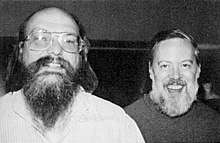

<table class="infobox biography vcard">
<tbody>
<tr>
<th colspan="2">

Ken Thompson

</th>
</tr>
<tr>
<td colspan="2">

Thompson (left) with&nbsp;<a title="Dennis Ritchie" href="https://en.wikipedia.org/wiki/Dennis_Ritchie">Dennis Ritchie</a>

</td>
</tr>
<tr>
<th scope="row">Born</th>
<td>

Kenneth Lane Thompson

 February 4, 1943&nbsp;(age&nbsp;77) 

<a title="New Orleans" href="https://en.wikipedia.org/wiki/New_Orleans">New Orleans</a>,&nbsp;<a title="Louisiana" href="https://en.wikipedia.org/wiki/Louisiana">Louisiana</a>, U.S.

</td>
</tr>
<tr>
<th scope="row">Nationality</th>
<td class="category">American</td>
</tr>
<tr>
<th scope="row">Alma&nbsp;mater</th>
<td><a title="University of California, Berkeley" href="https://en.wikipedia.org/wiki/University_of_California,_Berkeley">University of California, Berkeley</a>&nbsp;(B.S., 1965; M.S., 1966)</td>
</tr>
<tr>
<th scope="row">Known&nbsp;for</th>
<td>

<ul>
<li><a title="Unix" href="https://en.wikipedia.org/wiki/Unix">Unix</a></li>
<li><a title="B (programming language)" href="https://en.wikipedia.org/wiki/B_(programming_language)">B (programming language)</a></li>
<li><a title="Belle (chess machine)" href="https://en.wikipedia.org/wiki/Belle_(chess_machine)">Belle (chess machine)</a></li>
<li><a title="UTF-8" href="https://en.wikipedia.org/wiki/UTF-8">UTF-8</a></li>
<li><a title="Plan 9 from Bell Labs" href="https://en.wikipedia.org/wiki/Plan_9_from_Bell_Labs">Plan 9 from Bell Labs</a></li>
<li><a title="Inferno (operating system)" href="https://en.wikipedia.org/wiki/Inferno_(operating_system)">Inferno (operating system)</a></li>
<li><a title="Grep" href="https://en.wikipedia.org/wiki/Grep">grep</a></li>
<li><a title="Endgame tablebase" href="https://en.wikipedia.org/wiki/Endgame_tablebase">Endgame tablebase</a></li>
<li><a title="Go (programming language)" href="https://en.wikipedia.org/wiki/Go_(programming_language)">Go</a></li>
</ul>

</td>
</tr>
<tr>
<th scope="row">Awards</th>
<td>

<ul>
<li><a title="IEEE Emanuel R. Piore Award" href="https://en.wikipedia.org/wiki/IEEE_Emanuel_R._Piore_Award">IEEE Emanuel R. Piore Award</a>&nbsp;<small>(1982)</small></li>
<li><a title="Turing Award" href="https://en.wikipedia.org/wiki/Turing_Award">Turing Award</a>&nbsp;<small>(1983)</small></li>
<li><a title="Member of the National Academy of Sciences" href="https://en.wikipedia.org/wiki/Member_of_the_National_Academy_of_Sciences">Member of the National Academy of Sciences</a>&nbsp;<small>(1985)</small></li>
<li><a title="IEEE Richard W. Hamming Medal" href="https://en.wikipedia.org/wiki/IEEE_Richard_W._Hamming_Medal">IEEE Richard W. Hamming Medal</a>&nbsp;(1990)</li>
<li><a title="Computer Pioneer Award" href="https://en.wikipedia.org/wiki/Computer_Pioneer_Award">Computer Pioneer Award</a>&nbsp;<small>(1994)</small></li>
<li><a class="mw-redirect" title="National Medal of Technology" href="https://en.wikipedia.org/wiki/National_Medal_of_Technology">National Medal of Technology</a>&nbsp;<small>(1998)</small></li>
<li><a title="Tsutomu Kanai Award" href="https://en.wikipedia.org/wiki/Tsutomu_Kanai_Award">Tsutomu Kanai Award</a>&nbsp;<small>(1999)</small></li>
<li><a title="Harold Pender Award" href="https://en.wikipedia.org/wiki/Harold_Pender_Award">Harold Pender Award</a>&nbsp;<small>(2003)</small></li>
<li><a title="Japan Prize" href="https://en.wikipedia.org/wiki/Japan_Prize">Japan Prize</a>&nbsp;<small>(2011)</small></li>
</ul>

</td>
</tr>
<tr>
<td colspan="2"><strong>Scientific career</strong></td>
</tr>
<tr>
<th scope="row">Fields</th>
<td class="category"><a title="Computer science" href="https://en.wikipedia.org/wiki/Computer_science">Computer science</a></td>
</tr>
<tr>
<th scope="row">Institutions</th>
<td><a title="Bell Labs" href="https://en.wikipedia.org/wiki/Bell_Labs">Bell Labs</a> Entrisphere, Inc <a title="Google" href="https://en.wikipedia.org/wiki/Google">Google</a></td>
</tr>
</tbody>
</table>

 

<strong>Kenneth Lane Thompson</strong>&nbsp;(born February 4, 1943) is an American pioneer of&nbsp;<a title="Computer science" href="https://en.wikipedia.org/wiki/Computer_science">computer science</a>. Thompson worked at&nbsp;<a title="Bell Labs" href="https://en.wikipedia.org/wiki/Bell_Labs">Bell Labs</a>&nbsp;for most of his career where he designed and implemented the original&nbsp;<a title="Unix" href="https://en.wikipedia.org/wiki/Unix">Unix</a>&nbsp;operating system. He also invented the&nbsp;<a title="B (programming language)" href="https://en.wikipedia.org/wiki/B_(programming_language)">B programming language</a>, the direct predecessor to the&nbsp;<a title="C (programming language)" href="https://en.wikipedia.org/wiki/C_(programming_language)">C programming language</a>, and was one of the creators and early developers of the&nbsp;<a title="Plan 9 from Bell Labs" href="https://en.wikipedia.org/wiki/Plan_9_from_Bell_Labs">Plan 9</a>&nbsp;operating system. Since 2006, Thompson has worked at&nbsp;<a title="Google" href="https://en.wikipedia.org/wiki/Google">Google</a>, where he co-invented the&nbsp;<a title="Go (programming language)" href="https://en.wikipedia.org/wiki/Go_(programming_language)">Go programming language</a>.

Other notable contributions included his work on&nbsp;<a title="Regular expression" href="https://en.wikipedia.org/wiki/Regular_expression">regular expressions</a>&nbsp;and early computer text editors&nbsp;<a title="QED (text editor)" href="https://en.wikipedia.org/wiki/QED_(text_editor)">QED</a>&nbsp;and&nbsp;<a title="Ed (text editor)" href="https://en.wikipedia.org/wiki/Ed_(text_editor)">ed</a>, the definition of the&nbsp;<a title="UTF-8" href="https://en.wikipedia.org/wiki/UTF-8">UTF-8</a>&nbsp;encoding, and his work on computer chess that included the creation of&nbsp;<a title="Endgame tablebase" href="https://en.wikipedia.org/wiki/Endgame_tablebase">endgame tablebases</a>&nbsp;and the chess machine&nbsp;<a title="Belle (chess machine)" href="https://en.wikipedia.org/wiki/Belle_(chess_machine)">Belle</a>.

 

<h2> Publications </h2>
<ul>
 <li><a target="_blank" href="https://github.com/manjunath5496/Ken-Thompson-papers/blob/master/ken(1).pdf" style="text-decoration:none;">Password Security: A Case History</a></li>
  
<li><a target="_blank" href="https://github.com/manjunath5496/Ken-Thompson-papers/blob/master/ken(2).pdf" style="text-decoration:none;">Unix and Beyond: An Interview with Ken Thompson </a></li>  
  
<li><a target="_blank" href="https://github.com/manjunath5496/Ken-Thompson-papers/blob/master/ken(3).pdf" style="text-decoration:none;">A New C Compiler</a></li>
                               
 <li><a target="_blank" href="https://github.com/manjunath5496/Ken-Thompson-papers/blob/master/ken(4).pdf" style="text-decoration:none;">Reflections on Trusting Trust</a></li>                              
<li><a target="_blank" href="https://github.com/manjunath5496/Ken-Thompson-papers/blob/master/ken(5).pdf" style="text-decoration:none;"> Plan 9 from Bell Labs </a></li>
 <li><a target="_blank" href="https://github.com/manjunath5496/Ken-Thompson-papers/blob/master/ken(6).pdf" style="text-decoration:none;">UNIX Implementation </a></li>
                <li><a target="_blank" href="https://github.com/manjunath5496/Ken-Thompson-papers/blob/master/ken(7).pdf" style="text-decoration:none;">The UNIX Time-Sharing System </a></li>                                
         
 <li><a target="_blank" href="https://github.com/manjunath5496/Ken-Thompson-papers/blob/master/ken(8).pdf" style="text-decoration:none;">Regular Expression Search Algorithm</a></li>
                <li><a target="_blank" href="https://github.com/manjunath5496/Ken-Thompson-papers/blob/master/ken(9).pdf" style="text-decoration:none;">Hello World</a></li>     

</ul>

